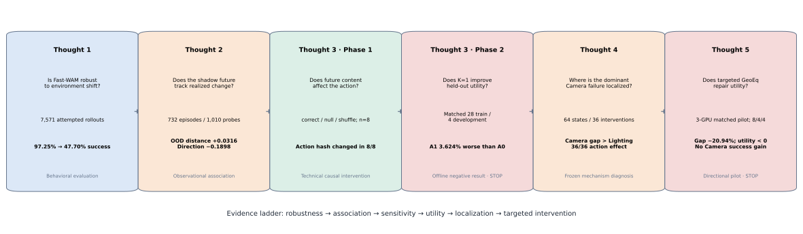
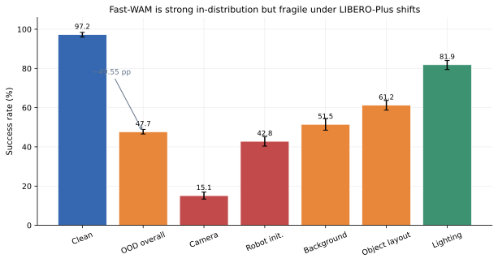
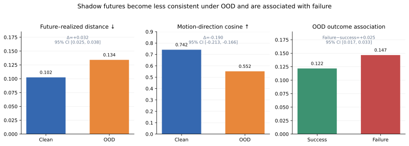
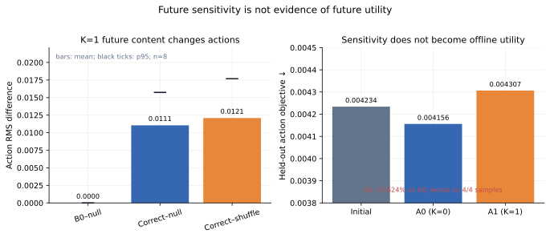
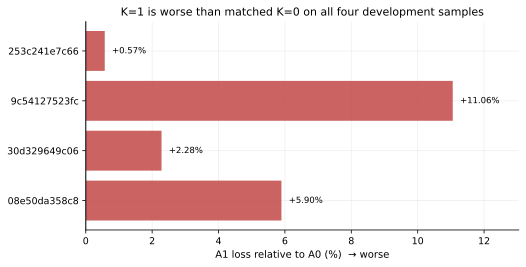
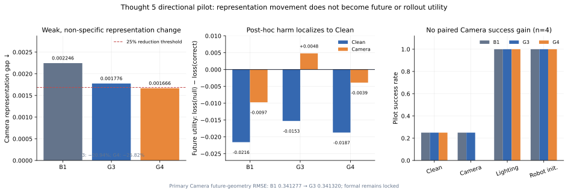

# 未来敏感性不等于未来效用：Fast-WAM 在 LIBERO-Plus OOD 环境中的分层审计

## Future Sensitivity Is Not Future Utility: A Layered Audit of Fast-WAM under LIBERO-Plus Distribution Shifts

**作者：** 待填写  
**单位：** 待填写  
**联系邮箱：** 待填写  
**稿件状态：** 完整研究草稿，证据冻结于 2026-08-06

---

## 摘要

世界动作模型可以在生成机器人动作的同时建模视觉未来，但测试时是否必须显式
想象未来，尤其在环境分布外（out-of-distribution, OOD）条件下，仍缺少分层且
可识别的实证分析。本文以官方 Fast-WAM `libero_uncond_2cam224` checkpoint
为对象，构建从行为评测、离线一致性、技术反事实、轻量 Adapter 效用、机制
定位到针对性方法干预的六层证据链。首先，在冻结权重、动作接口和基础任务后，
我们完成 800 个标准 LIBERO
与 6,771 个 runnable LIBERO-Plus rollout。成功率从 97.25% 降至 47.70%，
绝对下降 49.55 个百分点；相机视角扰动最严重，成功率仅 15.13%。其次，在
732 个 episode、1,010 个不反馈控制的 shadow future probe 上，OOD 相对
Clean 的 future–realized latent cosine distance 增加 0.0316
（95% task-cluster bootstrap CI 0.0254–0.0381），视觉运动方向 cosine 降低
0.1898（95% CI 0.1664–0.2134），且这种不一致与失败相关。该结果是观察关联，
不能解释为 future error 导致动作失败。第三，我们实现冻结 Fast-WAM 主体、
仅训练 1.371M 参数的 Future-to-Action Adapter，并通过 K=1
correct/null/shuffle 反事实确认 future 内容在 8/8 样本上改变动作。最后，
在一个 LIBERO-Goal task 的预注册 28-train/4-development matched 对照中，
K=0 的 held-out action objective 改善 1.845%，K=1 则恶化 1.712%；K=1
最终 loss 比 K=0 高 3.624%，四条 development sample 均更差。根据冻结停止
规则，我们没有继续选择 checkpoint、训练 K=2/K=4 或启动 OOD rollout。
为定位最严重的 Camera 缺口，我们进一步冻结主干，在 64 个 base state 的
exact-state paired diagnosis 中发现 Video Camera−Clean geometry error gap
为 0.020273 m，高于 Lighting 的 0.011660 m；probe-defined rank-3 geometry
subspace 的 shuffle 在 36/36 次离线干预中使动作超过 replay floor，而 correct
control 逐位恢复。冻结分类为 `camera_equivariance_gap`。基于该诊断，我们又
预注册并三卡运行单任务 Fast-WAM-GeoEq Pilot：G3 使 Camera representation
gap 缩小 20.94%，未达到 25% 门槛，主 future geometry RMSE 未改善，correct
future utility 仍为 −0.005231，Camera success 与基线同为 1/4。五项方向门禁
均为 false，故停止当前配方并锁定正式多任务实验。只读失败分解进一步将伤害
定位于 Clean/低 effective-sigma objective，但不能独立识别 RayPose 的因果贡献。
结果表明，**future 内容能影响动作并不意味着 future 对控制有用**。本文既不
证明 Fast-WAM 在 OOD 中普遍不需要未来，也不证明未来无效；它给出一个可复现的
负结果与方法学结论：future prediction、future-conditioned action sensitivity
和任务效用必须分别验证。

**关键词：** 世界动作模型；机器人操作；分布外泛化；未来想象；反事实评测；
相机等变性；负结果；LIBERO-Plus

## Abstract

World action models can jointly model visual futures and robot actions, yet it
remains unclear whether explicit test-time future imagination is necessary,
particularly under out-of-distribution (OOD) environment shifts. We present a
six-level evidence audit of the released Fast-WAM
`libero_uncond_2cam224` checkpoint, separating behavioral robustness,
observational future consistency, technical action sensitivity, downstream
utility, mechanism localization, and targeted intervention. First, with model
weights, action interfaces, and base tasks frozen,
we execute 800 standard LIBERO and 6,771 runnable LIBERO-Plus rollouts.
Success drops from 97.25% to 47.70%, an absolute decrease of 49.55 percentage
points; camera perturbations are most severe at 15.13% success. Second, across
732 episodes and 1,010 control-isolated shadow-future probes, OOD increases the
future–realized latent cosine distance by 0.0316
(95% task-cluster bootstrap CI: 0.0254–0.0381) and decreases visual
motion-direction cosine by 0.1898 (95% CI: 0.1664–0.2134). These proxies are
also associated with failure, but the analysis is observational because the
base policy does not consume the shadow future. Third, we introduce a
1.371M-parameter Future-to-Action Adapter while freezing the Fast-WAM
backbone. A K=1 correct/null/shuffle intervention shows that future content
changes action tensors on all eight audited samples. Finally, in a
preregistered, matched 28-train/4-development ablation on one LIBERO-Goal
task, K=0 improves the held-out action objective by 1.845%, whereas K=1
worsens it by 1.712%; the final K=1 loss is 3.624% higher than K=0 and is
worse on all four development samples. Frozen stopping rules prevent
post-hoc checkpoint selection, K=2/K=4 training, and OOD rollout evaluation.
To localize the dominant camera failure, we additionally freeze the backbone
and run an exact-state geometry–action diagnosis over 64 base states. The
Video Camera-minus-Clean geometry-error gap is 0.020273 m, compared with
0.011660 m for Lighting. Shuffling a probe-defined rank-3 geometry subspace
changes actions above the replay floor in 36/36 offline interventions, while
the correct reconstruction is bitwise exact. This yields the frozen diagnosis
`camera_equivariance_gap`. We then preregister and run a three-GPU, single-task
Fast-WAM-GeoEq pilot. G3 reduces the Camera representation gap by 20.94%, below
the 25% gate; the primary future-geometry RMSE does not improve, correct-future
utility remains negative at −0.005231, and Camera success is unchanged at 1/4.
All five directional gates are false, so the recipe is stopped before formal
multitask evaluation. A post-hoc read-only decomposition localizes damage to
Clean/low-effective-sigma objectives but cannot isolate the causal contribution
of RayPose.
Our central finding is that **future sensitivity is not future utility**.
The study does not establish that future imagination is universally
unnecessary; instead, it provides a reproducible negative result and an
evaluation framework that keeps prediction quality, action dependence, and
task utility conceptually and experimentally distinct.

**Keywords:** world action model; robotic manipulation; out-of-distribution
generalization; future imagination; counterfactual evaluation; camera
equivariance; negative result

---

## 1. 引言

视觉语言机器人策略需要从当前观测和语言指令生成连续控制动作。显式世界模型
提供了一种直观的规划路径：预测候选动作对应的未来，再根据未来选择动作。
然而，未来视频生成通常带来额外去噪计算、显存占用和时延；更重要的是，生成
“看起来合理”的未来并不保证它能改善动作。Fast-WAM 因此提出一个直接问题：
世界动作模型在测试时是否必须显式生成未来 [1]？

这一问题在标准分布上可能被高成功率掩盖。一个 current-only 策略即使在标准
LIBERO 中接近饱和，也可能依赖相机、纹理、光照、物体位置或机器人初始状态的
稳定性。环境变化后，显式 future 可能成为纠错信号，也可能把视觉生成误差继续
注入动作分支。仅比较标准 benchmark 分数无法区分这两种情况。

评估中还存在三个经常被混用的命题：

1. 模型可以生成 future；
2. 动作会随着 future 内容改变；
3. future-conditioned 动作能提高任务成功率。

第一项是生成能力，第二项是技术依赖，第三项才是任务效用。由第一项或第二项
直接推断第三项，会把“被使用”误写成“有帮助”。同样，在 OOD 下同时观察到
future prediction 变差和任务失败，也不能自动得到“future error 导致失败”；
环境 shift 可能同时破坏两者。

本文不从训练一个大型新模型开始，而是沿证据强度逐级推进。我们先回答官方
Fast-WAM 在标准 LIBERO [2] 与 LIBERO-Plus [3] 环境扰动之间的真实性能差距，
再将其 future prediction 作为不干预控制的 shadow observer，随后实现轻量
Future-to-Action Adapter，通过输入反事实确认 future 是否进入动作，最后使用
matched K=0/K=1 训练检查这种依赖能否转化为 held-out action objective 收益，
并用冻结的 geometry–action probe 与离线 subspace intervention 定位最严重的
Camera 缺口属于哪一类机制；最后预注册针对该机制的 GeoEq Pilot，检验表征变化
是否能进一步转化为 future utility 与 paired rollout success。

本文的主要贡献如下：

1. **大规模 OOD 行为审计。** 在 4 个 suite、40 个基础任务上完成 7,571 个
  实际 rollout，0 exception，并报告 Clean/OOD、五类扰动、难度、任务与时延。
2. **控制隔离的 future consistency 分析。** 在 732 个 episode、1,010 个
   probe 上保存 current/predicted/actual 视觉证据，使用 task-cluster bootstrap
   分析 OOD 差异与成败关联，同时保持即将执行的动作不变。
3. **future 内容的技术因果检验。** 通过 correct/null/other-episode shuffle
   干预、B0 replay 和动作 hash 保护，确认 K=1 future 的具体内容会改变动作，
   而不仅是 Adapter hook 的存在。
4. **预注册的轻量 Adapter 负结果。** 在冻结 Fast-WAM 的 matched
   K=0/K=1 训练中，K=1 未改善 held-out objective；我们按停止规则保留负结果，
   不用 checkpoint、K 或 OOD outcome 进行事后选择。
5. **可审计的研究方法。** 所有阶段隔离输出、记录 SHA、区分 invalid
   engineering run 与 valid negative result，并提供从机器工件自动生成的图表。
6. **Camera 缺口的冻结机制诊断。** 通过 exact-state Camera/Lighting 对照、
   跨 seed linear probe、FP32 subspace arithmetic 与 correct/shuffle 动作干预，
   将下一方法假设定位为 camera equivariance，而不把离线动作变化写成成功率。
7. **针对性方法的负向 Pilot 与失败分解。** 三卡 matched B1/G3/G4 Pilot 未通过
   representation、future geometry、future utility 或 rollout 方向门禁；我们停止
   正式多任务实验，并用不改写源工件的只读分析将下一假设收窄到条件/噪声依赖与
   RayPose/共享正则化识别。

本文的结论不是“未来无用”，而是一个更窄也更可靠的命题：在所测 Fast-WAM
checkpoint 与轻量 K=1 Adapter 配方下，future 的动作敏感性没有转化为
held-out 离线效用；针对 Camera 等变性缺口的当前 G3 配方也没有形成单任务 Pilot
的闭环收益。OOD success 的 future 总体因果效应仍待独立研究。

## 2. 相关工作

### 2.1 世界模型、动作扩散与测试时未来

世界模型通过学习环境动态的紧凑表示支持预测、规划或策略学习 [5,6]。在机器人
操作中，扩散式策略将动作块建模为条件生成过程，为多模态连续控制提供了统一
接口 [4]。世界动作模型进一步尝试在视频生成与动作生成之间共享表示或联合建模，
使视觉动态先验能够参与控制。

Fast-WAM 采用视频与动作扩散专家，并研究是否可以跳过测试时完整 future
imagination，从当前世界表征直接生成动作 [1]。其发布的 LIBERO unconditioned
checkpoint 为本文提供了一个重要审计对象：它能在标准 benchmark 上执行动作，
同时可以旁路恢复 unconditional future，但基础动作路径不直接读取生成的
future frame。这个结构使“future prediction 与失败是否相关”和“动作是否因
future 改变”成为两个不同问题。

### 2.2 机器人操作基准与环境 OOD

LIBERO 提供包含空间关系、物体、目标与长时序任务的机器人操作 benchmark，
常用于知识迁移与策略评测 [2]。LIBERO-Plus 在相同任务语义附近系统改变相机、
光照、背景、物体布局、机器人初始状态等环境因素，用于更细粒度的鲁棒性分析
[3]。与只对图像施加后处理不同，LIBERO-Plus 的变体可涉及 BDDL、场景 XML、
初始状态和 observation wrapper，因此能暴露视觉与控制共同作用下的失效。

本文使用标准 LIBERO 作为 Clean/ID 条件，使用 LIBERO-Plus 官方预生成变体作为
环境 OOD 条件。由于 Fast-WAM release 训练配置已经包含四个 LIBERO suite，
本文不把这些任务命名为 unseen task 或 unseen object；由于只评测 LIBERO 系
仿真，也不声称跨平台或真机泛化。

### 2.3 从相关性到效用的证据边界

模型内部表征与失败相关，不代表该表征在因果上驱动失败；输入干预改变动作，
也不代表改变方向有益。本文借鉴消融与反事实评测的一般原则，将证据分为四级：

1. 在线行为结果；
2. 不干预控制的观察关联；
3. 固定其余变量的技术输入干预；
4. matched 训练与任务效用。

这一分层是本文区别于单一成功率对比或可视化案例分析的核心。负结果同样需要
工程完整性、预注册终点与停止规则，否则容易被实现错误或事后选择污染。

## 3. 问题定义

### 3.1 基础策略与环境

记当前双相机观测、机器人状态和语言指令分别为
\(o_t\)、\(s_t\) 与 \(g\)。官方 current-only Fast-WAM 策略记为

\[
\mathbf{a}_{t:t+H-1} = \pi_0(o_t, s_t, g; \epsilon_a),
\]

其中 \(H=32\) 为动作块长度，\(\epsilon_a\) 表示冻结的动作扩散随机量。
Clean 环境分布记为 \(\mathcal{E}_{ID}\)，五类 LIBERO-Plus 环境分布记为
\(\mathcal{E}_{OOD}\)。

主要行为量为成功率

\[
\mathrm{SR}(\mathcal{E}) =
\frac{\#\text{successful attempted episodes}}
     {\#\text{attempted episodes}},
\]

以及绝对 OOD 下降

\[
\Delta_{\mathrm{SR}} =
\mathrm{SR}(\mathcal{E}_{ID}) -
\mathrm{SR}(\mathcal{E}_{OOD}).
\]

`skipped` 变体与实际 attempted 分母分离，运行异常单独计数。

### 3.2 Shadow future consistency

冻结视频模型从当前输入采样预测 future
\(\hat I_{t+\delta}\)，受保护原动作实际执行后获得
\(I_{t+\delta}\)。两者经过同一冻结 VAE 编码器 \(E(\cdot)\)，定义：

\[
d_{\cos} =
1-\cos(E(\hat I_{t+\delta}),E(I_{t+\delta})),
\]

\[
d_{L1} =
\lVert E(\hat I_{t+\delta})-E(I_{t+\delta})\rVert_1.
\]

预测视觉变化 \(\Delta \hat z\) 与实际视觉变化 \(\Delta z\) 的方向一致性为

\[
c_{\mathrm{motion}} =
\cos(\Delta \hat z,\Delta z).
\]

这些量是 decoded-frame VAE proxy，不是语义 future 正确率，也不是动作与
future 在同一向量空间中的 cosine。

### 3.3 Partial-future Adapter

冻结视频模型产生 K 步去噪的原生 future latent：

\[
z^K_f = F_K(o_t,g;\epsilon_f), \quad K \in \{1,2,4\}.
\]

轻量 Adapter 将 future latent 投影并通过 cross-attention 注入 Action DiT
hidden state：

\[
h'_a = h_a + \gamma A_\theta(h_a,z^K_f,m_f),
\]

其中 \(\gamma\) 为 zero-initialized gate，\(m_f\) 为 future mask，
\(\theta\) 是唯一可训练参数。Fast-WAM 主体全部冻结。

本文区分三个基线：

- **B0**：官方 Fast-WAM，无 Adapter；
- **A0**：具有相同 Adapter 训练结构，以同 shape/dtype 的全零 latent
  作为 K=0 control，并走同一 projector/attention；
- **A1**：提供在线或缓存的 K=1 model-generated future latent。

A0 用于分离“新增 Adapter/训练”与“future 内容”的影响；它不能与 B0 混称。

### 3.4 研究问题

- **RQ1：** Fast-WAM 在标准 LIBERO 上表现良好时，是否仍对环境 OOD 敏感？
- **RQ2：** OOD 下 shadow future–realized consistency 是否下降并与失败相关？
- **RQ3：** K=1 future latent 的具体内容是否真正影响动作输出？
- **RQ4：** 这种影响是否在冻结的轻量 Adapter 配方中改善 held-out action
  objective？
- **RQ5：** 现有证据是否足以回答 future 能否改善 OOD success？
- **RQ6：** 最严重的 Camera OOD 缺口更符合 geometry unreadability、action
  interface gap，还是 camera equivariance gap？
- **RQ7：** 针对该缺口的 GeoEq 配方能否在单任务方向性 Pilot 中同时改善
  representation、future utility 与 Camera rollout success？

## 4. 方法

### 4.1 总体证据阶梯



六层证据使用独立 namespace 和输出目录。Thought 1/2 冻结后，Thought 3
不能修改其 runner、结果或 checkpoint。每一阶段只在前一阶段回答了更弱问题后
进入更强干预；工程失败不登记为科学结果。

### 4.2 Thought 1：只评测，不改模型

我们锁定同一 checkpoint SHA、dataset stats、Fast-WAM commit、动作后处理、
control horizon 和基础 task。Clean 运行原版 LIBERO；OOD 运行
LIBERO-Plus。由于两个上游都导出 `libero` 包，评测器按独立进程选择 backend，
避免同一解释器中的 import 污染。

正式计划包含 800 个 Clean episode 与 6,839 个 OOD 变体。Clean 对 40 个任务
各运行 20 个固定 init state；OOD 枚举选中的官方变体，每个变体运行一次。
其中 68 个 OOD 变体经预检不可运行并登记为 skipped，剩余 6,771 个进入实际
分母。五类扰动为：

1. Camera Viewpoints；
2. Light Conditions；
3. Background Textures；
4. Objects Layout；
5. Robot Initial States。

所有 episode 保存确定性 job ID、seed、task/variant identity、checkpoint 和
source provenance、成功状态、步数、延迟、显存与失败视频路径。聚合器拒绝
checkpoint 不一致、job 重复/遗漏、NaN 或未解释异常。

### 4.3 Thought 2：控制隔离的 shadow diagnostics

Thought 2 复用 Thought 1 的 checkpoint 与任务身份，但在每个 probe 中将动作
保护在先：

```text
current observation
  ├─→ original action → environment → realized future
  └─→ offline unconditional future ──→ comparison only
```

future 生成不改变即将执行的动作。每次 probe 保存 current frame、predicted
future、actual post-action frame、protected action 和 outcome。正式 cohort
覆盖 200 个 Clean 与 532 个 OOD episode，共 1,010 probes 和 2,020 个对齐
future frame。

为避免静止场景使方向 cosine 失真，我们使用独立的 200-job no-op/null set
冻结 motion threshold `0.0167421166`。主要分析先将 probe 聚合到 episode，
再按 task 等权，并进行 suite-stratified task-cluster bootstrap 10,000 次。
由于失败 episode 可有两个 probe、成功 episode 只有一个，我们将全部可用
probe 作为 primary，同时报告 first-probe-only 敏感性分析。

该分析计划与运行前 DRAFT 一致，但没有在正式指标生成前冻结，故证据标签为
“formal collection + protocol-consistent post-run analysis”，而不是预注册
confirmatory analysis。

### 4.4 Future-to-Action Adapter 与离线 cache

Adapter 包含 Conv3d future projector、位置表示、多头 cross-attention、
mask 和 zero gate，共 1,371,137 个参数。Video DiT、VAE 和 Action DiT 主体
保持 `eval/frozen`；optimizer 只允许包含 `adapter.*` 参数。zero gate 保证
初始 A0 与 current-only 路径逐位一致，并使第一步仅 gate 获得非零梯度；
第二步起其他 Adapter 参数应获得非零梯度。

为节省 3×RTX 4090 级别硬件上的训练成本，冻结视频模型后按样本预先生成
K=1/2/4 future latent。每个 K 使用同一初始噪声与 sample identity，直接保存
BF16 原生 latent `[48,2,14,28]`，不经 future RGB decode。cache 记录 shard、
tensor 和逐样本 checksum，支持原子提交、断点恢复和损坏拒绝。

工程门禁依次完成：

- Phase B：CPU/mock 的 Adapter、cache、trainer、checkpoint 和旧 CLI 回归；
- Phase C：单卡单条真实 LIBERO 样本的 K1/K2/K4、forward/backward/memory；
- Phase D：32 个样本×3 个 K，共 96 latent、12 个 shard 的真实 cache smoke；
- Gate E：从单样本可拟合到 multi-flow、fresh cohort、trajectory 与 tail
  mitigation 的 fail-closed 训练诊断。

Gate E 的开发结果不进入 OOD 主表，其作用是证明训练链路有效并冻结停止规则。

### 4.5 Thought 3 Phase 1：K=1 动作反事实

我们使用固定 E6 A1@`3e-4` step-200 checkpoint 和同一 task 的八条 train
sample，设置四个条件：

1. `B0`：调用官方 `infer_action()` 两次以确定 deterministic replay floor；
2. `null`：不构造 future tensor、Video DiT call 或 Adapter call；
3. `correct`：从 recipient 当前观测在线生成 K=1 future；
4. `shuffle`：使用 other-episode donor future，只替换 future 内容。

recipient 的 current/context、future noise seed、action noise seed 和 action
timestep seed在 correct 与 shuffle 间保持一致。运行不读取 action target、
future RGB、development、OOD、rollout success 或训练 cache；0 backward、
0 optimizer。主要判据在运行前冻结为：

- B0/null \(L_\infty \le 10^{-5}\)；
- correct−null 超过 replay floor 的样本不少于 6/8；
- correct−shuffle 超过 floor 的样本不少于 6/8；
- correct/shuffle action hash 改变不少于 6/8。

这个实验识别的是 future-content action sensitivity，不识别任务收益。

### 4.6 Thought 3 Phase 2：matched K=0/K=1 训练

Phase 2 只使用标准 LIBERO `open the middle drawer of the cabinet` task。42 个
episode 先按 identity 做确定性 90/10 split，再固定 28 条 train 和 4 条
development sample，均使用 frame 0。训练读取当前观测、动作 target 和模型
生成的 future cache，不读取真实 future RGB、OOD、success 或 rollout。

A0 与 A1 使用完全相同的：

- sample identity 与顺序；
- normalized sample-loss weight；
- action flow/noise/timestep schedule；
- LR `3e-4`、seed 3407；
- 200 updates，每次覆盖 28 个 objective；
- 固定 step-200 primary endpoint。

两轨分别在两张 GPU 上运行，各完成 5,600 个 training objective。Development
只在 step 0 和 step 200 评测，不用于 checkpoint selection。预注册 positive
direction 要求：

1. A1 final development mean 小于 A0；
2. A1 相对 shared initial 的 reduction 大于 0；
3. 全部工程 hard checks 通过。

任一不满足即停止，不复验完整 checkpoint、不启动 OOD rollout、不训练 A2/A4，
也不选择 step 50/100/150。

### 4.7 Thought 4：冻结 Geometry–Action Gap 诊断

Thought4 不重开 Adapter 路线，也不训练 Fast-WAM。它使用一个固定
`libero_goal` task 的 64 个 base state，按 40/12/12 划分 train/dev/test，
对每个 state 渲染 Clean、Camera、Lighting 与 Robot-init 共 256 个样本。Camera
与 Lighting 保持 simulator state 和动作前缀一致；Robot-init 会改变初始机器人
状态，故只作为非 exact-state 探索对照。

我们在冻结 Video/Action 主干上捕获中间表征，并以跨三个 seed 的 linear probe
分别读取当前 geometry translation、当前 action geometry translation 和未来
SE(3) motion。probe 选择只读 development；test/OOD 不参与层选择。运行顺序为：

1. 先完成全部 Video/Action probe，并将 `probe_stage_result.json` 原子落盘；
2. 再选择 `mot.video_kv_cache.15.v` 的 rank-3 probe-defined subspace；
3. 对 12 个 test state × 3 个 action seed 执行 correct/shuffle coordinate
   replacement；
4. correct control 必须逐位恢复，shuffle 必须超过实测 replay floor。

为避免 BF16 reconstruction 自身造成假动作差异，正式实验前的 smoke v8 使用真实
`[1,98,3072]` BF16 capture，所有 basis/projection/reconstruction 在 FP32 中
完成，只在 replacement 前做一次 BF16 cast。correct hidden 与输入 SHA 相同，
correct action L2 为 0。该实验只读取冻结表征和离线动作 tensor，不执行环境
action，不读取 success，也不评测任何新方法。

### 4.8 Thought 5：Camera-equivariant GeoEq 方向性 Pilot

Thought4 的冻结分类只解锁一个新候选，而不预先保证其有效。我们在
action-consumed `mot.video_kv_cache.15.v` 对应的 Video layer-15 K/V projection
安装 rank-8 LoRA；G3 同时使用训练期 Geo-REPA、relative camera pose、per-token
camera rays 与 equivariance/pose auxiliary objective。GeoProjector 在推理时移除，
GT depth 不进入策略输入。G4 只打乱逐样本 Geo-REPA correspondence，保留与 G3
相同的 RayPose、equivariance/pose loss 与 LoRA 训练，因此它是 specificity control，
不是“所有 geometry 都被移除”的 control。B1/G3/G4 的 trainable parameter budget
均为 1,335,320，Action DiT 保持冻结。

Pilot 使用一个 `libero_goal` task、互斥的 8 train / 4 development / 4 pilot-test
episode，并在三张 4090 上 matched 执行三条 track。预注册方向要求同时检查：

1. G3 Camera representation gap 相对 B1 至少缩小 25%，且不能由 G4 解释；
2. 主 K=1 future geometry error 改善；
3. correct future 相对 null 的 absolute utility 为正，并优于 shuffle；
4. Camera paired rollout success 提高且 Clean 不劣；
5. training/development 方向与所有工程 hard checks 通过。

Pilot 未过门后，当前 G3 recipe 与 formal 多任务阶段立即锁定。后续分析仅在
CPU 上读取既有工件，逐 SHA 验证源文件前后不变；其 condition/sigma/RayPose
结论属于 post-hoc exploratory diagnosis，不能反向修改上述 Gate。

## 5. 实验设置

### 5.1 模型与软件

官方 Fast-WAM checkpoint SHA-256 为
`1000437cfcf55c000094f79a2600634c502bcb5b492476b94bf8509883a49579`，
Fast-WAM commit 为
`45d8e1458921d83f8ad6cf9ce993d371208dabd0`。环境使用 Python 3.10、
PyTorch 2.7.1+cu128、CUDA 12.8 与 headless MuJoCo/EGL。LIBERO 与
LIBERO-Plus commit 分别为 `8f1084e...` 与 `4976dc30...`。

### 5.2 数据规模

| 阶段 | 数据/运行单位 | 规模 |
| --- | --- | ---: |
| Thought 1 Clean | online rollout | 800 |
| Thought 1 OOD | runnable online rollout | 6,771 |
| Thought 1 skipped | 不进入 attempted 分母 | 68 |
| Thought 2 | shadow diagnostic episode | 732 |
| Thought 2 | probe / aligned frame | 1,010 / 2,020 |
| Phase D | base sample / cached latent | 32 / 96 |
| Thought 3 Phase 1 | fixed train sample | 8 |
| Thought 3 Phase 2 | train / development sample | 28 / 4 |
| Phase 2 training | A0 / A1 objective | 5,600 / 5,600 |
| Thought 4 | base state / paired render | 64 / 256 |
| Thought 4 | feature row / intervention comparison | 12,544 / 36 |
| Thought 5 Pilot | train / development / pilot-test episode | 8 / 4 / 4 |
| Thought 5 Pilot | matched variant / condition rollout | 3 / 48 |
| Thought 5 utility | variant × condition × flow objective | 3 × 2 × 128 |

这些分母服务于不同研究问题，不能相加成一个“总样本量”，也不能将 Phase 1 的
8/8 或 Phase 2 的 4/4 表述为机器人成功率。

### 5.3 统计口径

Thought 1 报告 attempted episode success 和 row-bootstrap 95% CI，同时给出
suite/category/difficulty/task 分层。Thought 2 以 40 task 等权为 primary，
进行 suite-stratified task-cluster bootstrap 10,000 次；多个 category
contrast 使用 BH q-value 辅助解释。Phase 1 是确定性工程反事实，只报告配对
效应、replay floor 与计数，不进行总体推断。Phase 2 只有四条 development
sample，按预注册方向作描述性判定，不追加事后显著性检验。Thought4 的 probe
跨三 seed 报告 frozen control；Camera/Lighting 使用 exact-state paired gap，
selected-coordinate contrast 使用按 base state 分组的 2,000 次 bootstrap。
Robot-init 不满足 exact-state，因此不能进入同等级的机制判定。
Thought5 只作单 task 方向门禁；每 condition 的 4 个 rollout 不做总体推断。
只读 condition bootstrap 是结果后探索性定位，不替换 Pilot primary endpoint。

### 5.4 硬件与审计

正式运行使用 NVIDIA RTX 4090。Thought 1/2 可按三张卡进行 episode-level
分片；Phase 1 严格单卡以共享 live model 和确定性状态；Phase 2 使用两张卡
并行 A0/A1，每个进程只暴露一个逻辑 `cuda:0`。所有阶段记录 peak allocated/
reserved memory、状态文件、config fingerprint、source/checkpoint SHA 和
artifact checksum。Thought4 formal v6 使用单张 RTX 4090，耗时 4,728.05 秒
（1:18:48）；1,586-entry artifact manifest 的逐文件路径、大小与 SHA 已只读
复核。Thought5 Pilot 使用三张 4090 同波执行 B1/G3/G4，总墙钟约 2 小时 29 分，
峰值显存 24,508.1 MiB；只读失败分解不使用 GPU、模型、仿真或新 rollout。

## 6. 结果

### 6.1 RQ1：Fast-WAM 在环境 OOD 下大幅掉点

800 个 Clean rollout 全部 attempted，成功 778 个；6,771 个 runnable OOD
rollout 全部完成，成功 3,230 个。两部分均无 exception、重复或遗漏。

| 条件 | Success/N | 成功率 | 95% CI | 平均 policy latency |
| --- | ---: | ---: | ---: | ---: |
| Clean | 778/800 | **97.25%** | [96.00%, 98.38%] | 972.06 ms |
| OOD | 3,230/6,771 | **47.70%** | [46.55%, 48.90%] | 969.84 ms |

绝对下降为 49.55 个百分点，相对下降为 50.95%。Clean 与 OOD 平均 policy
latency 只差约 2.22 ms，因此掉点不能归因于 OOD 推理速度下降。



五类扰动差异明显：

| OOD 类别 | Success/N | 成功率 | 95% CI |
| --- | ---: | ---: | ---: |
| Camera viewpoints | 242/1,599 | **15.13%** | [13.38%, 16.95%] |
| Robot initial states | 664/1,550 | 42.84% | [40.39%, 45.23%] |
| Background textures | 554/1,076 | 51.49% | [48.51%, 54.46%] |
| Objects layout | 934/1,525 | 61.25% | [58.75%, 63.67%] |
| Light conditions | 836/1,021 | 81.88% | [79.43%, 84.04%] |

按 LIBERO-Plus 难度分层，easy/medium/hard 成功率依次为
59.82%/49.51%/35.07%。但 task×category 交互很强，不能把一个总体类别排序
外推到每个任务。RQ1 的答案是肯定的：该 checkpoint 在标准场景接近饱和，
但对所测环境变化高度敏感，其中相机视角最严重。

### 6.2 RQ2：OOD 下 future consistency 下降并与失败相关

Thought 2 完成 732/732 个 episode、1,010/1,010 个 probe，0 probe error；
4,040 个 current/predicted/actual/comparison media 全部可解码。protected
action 在同一运行内 1,010/1,010 保持不变。

| 指标 | Clean | OOD | OOD−Clean | 95% CI |
| --- | ---: | ---: | ---: | ---: |
| Future latent cosine distance ↓ | 0.1025 | 0.1341 | **+0.0316** | [0.0254, 0.0381] |
| Future latent L1 ↓ | 0.1431 | 0.1708 | **+0.0277** | [0.0238, 0.0317] |
| Motion-direction cosine ↑ | 0.7416 | 0.5518 | **−0.1898** | [−0.2134, −0.1664] |



在 OOD outcome 对比中，排除两条 Phase 1/2 outcome mismatch 后，255 个 success
与 275 个 failure episode 同时覆盖 40 个 task。Failure 相对 success 的
future cosine distance 高 0.0249（95% CI 0.0166–0.0328），motion-direction
cosine 低 0.2127（95% CI 0.1923–0.2328）。只使用首 probe 时，关联仍存在：
distance +0.0197，direction −0.0784。

然而，一致性不是成功的充分或必要条件。首 probe 误差最低四分位仍有
55/132（41.67%）失败，最高四分位也包含成功案例。Camera 对 future proxy
破坏最大、lighting 最小，与 Thought 1 的大方向一致，但难度对所有 future
指标并非严格单调。

因此 RQ2 的答案是：**自动局部视觉一致性代理在 OOD 下稳定变差，并与失败
相关；但该设计不支持 future error 的因果归因。**

### 6.3 RQ3：Future 内容确实改变动作

Phase 1 的 B0 replay 与 formal null 完全一致：8/8 样本的 L1/L2/L∞ 为 0，
action SHA 不变。相比之下：

| Pair | Action hash 改变 | Action RMS L2 mean | p95 | Action cosine mean |
| --- | ---: | ---: | ---: | ---: |
| B0−null | 0/8 | 0 | 0 | 1.000000 |
| correct−null | **8/8** | 0.011052 | 0.015738 | 0.999769 |
| correct−shuffle | **8/8** | 0.012092 | 0.017690 | 0.999712 |

两个正式 pair 均在 8/8 样本上超过冻结 replay floor `1e-7`，满足预注册的
至少 6/8 判据。correct 与 shuffle 使用相同 recipient current/context、
future noise 与 action flow identity，donor 来自不同 episode。Fast-WAM 与
Adapter SHA 前后不变，0 gradient、0 backward、0 optimizer。

RQ3 因而得到一个有限但清晰的技术因果答案：**在该 checkpoint 和八条样本上，
替换 future latent 的具体内容会改变动作输出。** 变化量约为 B0 action-chunk
RMS 的 2.18%–2.38%，两个 delta 的方向 cosine 均值仅 0.446，尚不能解释为
稳定或正确的控制修正。

在线 correct 相对 null 的 paired mean overhead 为 258.95 ms（+6.17%）。
这表明即使一步粗 future 也有非零部署成本，但该成本尚未与 success 收益形成
可比较曲线。

### 6.4 RQ4：K=1 敏感性没有转化为 held-out 离线效用

Phase 2 的 A0/A1 均完成 200 updates×28 objectives，12/12 hard checks
全部通过。两轨的 Adapter checkpoint 可 round-trip，sample weight、训练
schedule 和 development flow 完全匹配，冻结 Fast-WAM 参数 SHA 前后相同。

| 版本 | Shared initial | Step-200 final | Reduction |
| --- | ---: | ---: | ---: |
| A0 / K=0 | 0.004234104 | **0.004155979** | **+1.845%** |
| A1 / K=1 | 0.004234104 | **0.004306583** | **−1.712%** |

A1 final mean 比 A0 高 0.000150604，即相对 A0 高 3.624%。



逐样本结果方向一致：

| Sample ID 前 12 位 | A0 final | A1 final | A1 相对 A0 |
| --- | ---: | ---: | ---: |
| `253c241e7c66` | 0.00600750 | 0.00604189 | +0.572% |
| `9c54127523fc` | 0.00253181 | 0.00281174 | +11.056% |
| `30d329649c06` | 0.00521795 | 0.00533706 | +2.283% |
| `08e50da358c` | 0.00286665 | 0.00303564 | +5.895% |



训练确实打开了 Adapter，而非梯度断链：两轨第一步仅 zero gate 有非零梯度，
第二步起 attention、future projector 等参数均获得非零梯度；step-200 gate
也非零。负方向因此不能简单归因于“future 没有进入模型”。

预注册 positive direction 的三项要求中，只有工程 hard checks 通过；A1
既没有低于 A0，也没有相对 initial 改善。冻结分类为
`training_valid_dev_direction_not_observed`，Phase 3 未解锁。

RQ4 的答案是：**在这一单 task、单 seed、固定 K=1 与固定训练配方中，没有
观察到 held-out action objective 收益，反而得到一致的描述性负方向。**

### 6.5 RQ5：现有证据仍不能回答 OOD success 因果效应

Thought 1 已确认 OOD 缺口，Thought 2 已确认 future proxy 关联，Phase 1 已
确认动作敏感性，Phase 2 则给出离线负方向。由于停止规则禁止进一步 rollout，
当前没有 A0/A1 在 Clean/OOD 中的 matched success 对照。因此：

- 不能说 K=1 会提高 OOD success；
- 不能说 K=1 会降低 OOD success；
- 不能将 development loss 的负方向替换为机器人任务失败；
- 不能回答 K=2/K=4 是否更好；
- 不能据此得出 Fast-WAM 普遍不需要 future。

RQ5 的答案是：**证据仍不足；本文停止在一个有效且可审计的离线负结果。**

### 6.6 RQ6：Camera 缺口更符合等变性问题，而非 geometry 完全不可读

Thought4 formal v6 完成 64 个 base state、256 个配对渲染、12,544 条特征与
全部 36 个干预 comparison。三个 Clean readability probe 均优于冻结 control：

| Probe | Clean error | Mean control | Shuffle control | 相对 mean 改善 |
| --- | ---: | ---: | ---: | ---: |
| Video geometry translation | **0.032814 m** | 0.061369 m | 0.067243 m | 46.53% |
| Action current geometry translation | **0.021851 m** | 0.061369 m | 0.077118 m | 64.39% |
| Action future motion SE(3) composite | **0.105583** | 0.197027 | 0.225015 | 46.41% |

因此，所测 Clean 表征并非缺少可线性读取的 geometry/motion。对 exact-state
扰动，Video probe 的 Camera−Clean RMSE gap 跨 seed 均值为
`+0.020273 m`，Lighting 为 `+0.011660 m`；Camera 的三个 seed 点估计均更大。
在冻结的 rank-3 coordinate 上，Camera shift 为 `0.295093`
（95% CI `[0.246436, 0.348635]`），Lighting 为 `0.148809`
（95% CI `[0.128494, 0.165712]`）；paired Camera−Lighting difference 为
`0.146284`（95% CI `[0.088519, 0.200310]`）。Robot-init 的冻结 distinct
pattern 判据为 false，且不满足 exact-state，不能支持独立机制结论。

subspace intervention 的 correct reconstruction 为 36/36 逐位恢复，correct
相对 unhooked action L2 全为 0；shuffle 为 36/36 超过 replay floor。shuffle
action L2 mean/min/max 为 `0.000768/0.000559/0.000913`，translation 与
rotation difference mean 为 `0.001094/0.000410`，gripper difference 为 0。
这证明 probe-defined geometry coordinates 对动作 tensor 有技术因果影响，但
动作没有在环境中执行，不能推断任务价值。

RQ6 的冻结答案是：**证据最符合 `camera_equivariance_gap`。** 推荐的下一方法
为 `Geo-REPA + relative pose / camera-ray equivariance`；该推荐是待检验假设，
不是方法效果或 OOD success 结果。

### 6.7 RQ7：针对性 GeoEq 配方产生弱表征变化，但未形成效用

三条 matched track 与全部 collector 均执行完成；负判定不是运行故障。G3 的
Camera representation gap 从 B1 的 0.002246 降至 0.001776，即缩小 20.94%，
低于预注册 25% 门槛；G3−B1 grouped bootstrap interval
`[−0.001146, 0.000175]` 跨 0。G4 的 gap 为 0.001666，反而缩小 25.82%，因此
G3 的变化不能被归因于正确逐样本 Geo-REPA correspondence。

主 Camera future-geometry RMSE 为 B1 0.341277、G3 0.341320、G4 0.341331，
没有改善。aggregate correct-future utility（`loss(null)−loss(correct)`）由 B1
的 −0.015649 缓解为 G3 的 −0.005231，但 G3 的 95% interval
`[−0.008987, −0.001763]` 仍完全为负；correct 虽优于 shuffle，却仍劣于 null。
paired rollout 中 B1/G3 的 Clean 与 Camera 均为 1/4，Lighting 与 Robot-init
均为 4/4；Camera 没有 gain。training、representation、future geometry、future
utility 与 rollout 五项方向 Gate 全为 false，`formal_unlocked=false`。



只读失败分解显示，G3 utility 在 Clean 为 −0.015268，在 Camera 为 +0.004807；
伤害主要集中于 effective sigma<0.5 的 flow objective。RayPose gate、梯度和
residual injection 均非零，说明路径执行且更新；但没有 matched gate-zero
checkpoint，LoRA 与 RayPose 又同时变化，故其独立因果贡献不可识别。G3/G4
training total trajectory correlation 为 0.999986，Video-source feature-delta
方向 cosine 均值为 0.938498，更符合共享 conditioning/auxiliary loss/regularization
解释，而非已确认的正确 correspondence 学习；由于 G1/G2 未运行，解释之间仍
不能选择。

RQ7 的答案是：**当前 G3 配方没有通过单任务方向性 Pilot，不能扩展到正式多任务
实验。** 该结果反对继续运行同一 recipe，而不否定 Thought4 的 Camera gap，也
不等于 Geo-REPA 或 camera-ray conditioning 的普遍无效性。

## 7. 讨论

### 7.1 为什么“敏感”不等于“有用”

Phase 1 证明 Adapter 不是空连接：correct 与 shuffle future 导致不同动作。
Phase 2 又证明“连接存在”不足以保证泛化方向。至少有四种可能解释：

1. **future 质量不足。** K=1 是极粗的去噪近似，包含的视觉动态可能不足以提供
   稳定规划信号。
2. **目标错配。** Adapter 训练优化 action flow objective，而不是 rollout
   success；更低的训练目标不一定对应更好的闭环控制。
3. **小数据与单任务。** 28 条训练样本不足以学习如何区分有用与有害的 future
   内容，四条 development sample 又不足以支持总体推断。
4. **注入方式不匹配。** 单点 cross-attention 与 zero gate 是算力友好的设计，
   但不保证能从视频 latent 中抽取动作相关的可控因素。

这些解释是后续假设，不是当前数据已经证明的机制。尤其不能因为 K=1 为负就
事后宣称 K=2/K=4 必然更好，或立即在同一 development 上搜索新 Adapter。

### 7.2 Thought 2 与 Thought 3 的互补关系

Thought 2 说明 OOD 下模型的短时视觉动态 proxy 也受损。若直接将该 future
接入动作，它可能提供规划信息，也可能把 OOD 误差注入控制。Thought 3 的
Phase 1 表明这种注入确实会产生动作变化，Phase 2 的负结果则与“误差可能被
传递”的风险一致，但没有直接证明这一机制。因为 Phase 2 使用标准 LIBERO
train/development，而非 OOD；且其 future latent 没有对应 Thought 2 的逐样本
一致性标签。

因此，当前最合理的综合解释是：

> OOD 对控制与 future prediction 同时构成挑战；如果要利用 future，模型还需
> 学会筛选其可靠性，而不是只把 future latent 接入 Action DiT。

这一解释可启发未来的 uncertainty-gated Adapter 或 confidence-aware planning，
但这些方案属于新研究，不属于本文已经验证的结果。

### 7.3 负结果的研究价值

若只报告 Thought 1，结论会停在“模型不鲁棒”；若只报告 Thought 2，容易把关联
误写成因果；若只报告 Phase 1，又容易把动作变化当成收益。Phase 2 的负结果
迫使证据链在“任务效用”处停下，并暴露出一个常被忽略的评测原则：

> 对 world-action model，必须分别报告预测质量、动作依赖、闭环成功率和计算
> 成本；任何一项都不能代替其他项。

保留负结果还减少了 outcome-driven 调参。本文没有根据四条 development sample
选择 checkpoint，没有降低旧门槛，也没有打开 OOD outcome 作为新的优化信号。

### 7.4 对“需要多少未来”的回答

原始目标希望比较 K=0/1/2/4 的成功率—时延曲线。当前只完成：

- K=0/K=1 的 matched 离线 objective；
- K=1 的在线动作敏感性与约 259 ms 增量；
- K=1/2/4 的离线 cache 与单样本采样工程遥测。

由于 K=1 未通过 frozen direction gate，K=2/K=4 正式训练与 rollout 没有解锁。
所以本文不能给出“最优 K”，只能给出一个更前置的判断：在投入完整 K sweep
之前，应先证明最小 K 的动作影响具有 held-out utility。当前配方没有做到。

### 7.5 从 future Adapter 转向 camera-equivariant representation

Thought4 没有推翻 Thought3 的负结果，而是把下一项研究从“继续增加 future
去噪步数”收缩为“先修复 Camera 下的 geometry consistency”。Clean geometry
可读、Camera gap 大于 Lighting、geometry subspace 又会影响动作，这三项组合
使 camera-equivariant representation 成为比盲目扩 K 更直接的假设。

不过，formal v6 只证明了表征 gap 与 action sensitivity。rank-3 subspace 只占
actual feature energy 的约 0.104%，shuffle 导致的动作变化也没有经过闭环执行。
因此下一阶段必须先在未使用 state/task 上验证 representation 与 SE(3) 指标，
再预注册 matched Camera rollout；不能从本次 diagnosis 直接声称 Geo-REPA、
relative pose 或 camera-ray conditioning 有效。

## 8. 局限性与有效性威胁

### 8.1 外部有效性

Thought 3 的效用实验只有一个 `libero_goal` task、一个训练 seed、28/4
sample 与 K=1；不能推广到其他 task、suite、机器人平台、真机、K 或 Adapter。
Fast-WAM release 训练覆盖四个 LIBERO suite，因此本文的 OOD 是环境 shift，
不是严格 unseen task/object。Thought4 也只覆盖一个 task 的 64 个 base state；
其层、rank 与 target 选择不能外推到其他任务或 backbone。

### 8.2 指标有效性

Thought 2 的 VAE latent distance 与 motion-direction cosine 只反映局部视觉
变化，不评估目标语义、接触物理、碰撞、物体身份或长时序恢复。自动 proxy
不能替代 outcome-blind 人工 future 正确性标注。Phase 2 的 action objective
也不是 rollout success。Thought4 linear readability 只说明信息可被一个 probe
读取，不证明原策略在自然执行中以同样方式使用该信息。

### 8.3 统计有效性

Thought 1 的 row-bootstrap 描述本次变体集合，不应解释为对所有现实环境的
总体置信区间。Thought 2 虽使用 task-cluster bootstrap，但分析计划未在正式
指标生成前预冻结。Phase 1 的八条和 Phase 2 的四条样本仅用于技术/方向门禁，
没有总体显著性资格。Thought4 的 Camera/Lighting 是 state-paired diagnosis；
Robot-init 会改变初始状态，故其对比资格更弱。多个 layer/probe 数字不能事后
改作确认性 endpoint。

### 8.4 因果有效性

Thought 2 的 future 不反馈动作，故只能支持关联。Phase 1 对动作输出具有技术
干预资格，但没有环境 rollout，不能识别 success 效应。Phase 2 是 matched
训练对照，但只读 development action target，不读 OOD/outcome。本文没有一项
实验可单独完成“future→动作→OOD success”的完整中介链。同样，Thought4
subspace intervention 只识别 hidden coordinate→action tensor，不识别
geometry correction→Camera rollout success。

### 8.5 工程与可复现性

两套 LIBERO backend 同名、GPU diffusion 推理可能存在跨运行数值差异，且视频
decoder 在 TorchCodec 不可用时回退到 PyAV。我们通过进程隔离、同次动作 hash、
commit/SHA、deterministic seed、atomic artifact 和 checksum 降低风险，但不能
保证跨硬件逐位复现。LIBERO-Plus 当前 pinned checkout 的代码/资产许可证边界
也应在公开分发前向上游确认。Thought4 的 1,586-entry artifact manifest 已逐项
验证；但 `execution_integrity.json` 的内嵌自哈希只覆盖初始 11 字段核心 payload，
不覆盖随后追加的 runtime/smoke/probe 字段。完整文件仍由 manifest 的文件 SHA
覆盖；该作用域缺陷被保留和披露，不原地修补冻结结果。

### 8.6 Thought5 的 Pilot 有效性边界

Thought5 的结果已在 6.7 节报告，但其外部与统计边界需要单列。该 Pilot 只有一个
task、一个训练 seed、8/4/4 episode split 和每 condition 4 个 rollout；它只能
决定当前 G3 recipe 是否值得进入 formal，不能作为 H1/H2/H3 的多任务否证。
G4 只 shuffle Geo-REPA correspondence，仍保留正确 equivariance/pose loss 与
RayPose，因此也不能把全部共享变化解释为普通正则化。结果后的 condition/sigma
bootstrap 仅用于生成新假设，不能回改 25% 门槛、选择 checkpoint 或重新使用同一
Pilot endpoint。完整边界见 [Thought5 协议](../thought5/protocol.md)、
[Pilot v4 结果](../thought5/pilot_v4_results.md)与
[只读失败分解](../thought5/pilot_v4_readonly_failure_analysis.md)。

## 9. 结论

本文围绕“Fast-WAM 在 OOD 环境中真的不需要未来想象吗？”建立了一条由弱到强
的证据链。

首先，官方 Fast-WAM 在标准 LIBERO 上达到 97.25% 成功率，却在五类
LIBERO-Plus 环境 shift 上降至 47.70%，表明 current-only release checkpoint
存在显著环境鲁棒性缺口。其次，不干预控制的 shadow diagnostics 显示，OOD 下
future–realized consistency proxy 变差且与失败相关，但这一观察不能用于
future error 的因果归因。再次，K=1 correct/null/shuffle 技术反事实证明
future 内容确实改变动作。最后，预注册的 matched K=0/K=1 训练发现，这种
动作敏感性没有转化为更好的 held-out action objective：K=1 比 K=0 高 3.624%，
四条 development sample 全部方向更差。进一步的冻结机制诊断显示，Clean
geometry/motion 可读，Camera 的 exact-state representation gap 大于 Lighting，
且 rank-3 geometry subspace 对动作 tensor 有技术因果影响；由此将下一假设
定位为 `camera_equivariance_gap`。针对该缺口的 Thought5 G3 Pilot 虽产生弱且
非特异的 representation 变化，却没有获得 positive future utility 或 Camera
success，因而停止在 formal 之前。

因此，本文最强且不过界的结论是：

> **Future sensitivity is not future utility.**

现有结果既不支持“显式 future 必然改善 OOD”，也不支持“Fast-WAM 普遍不需要
future”。它支持一种更严格的研究范式：先验证鲁棒性缺口，再区分预测关联、
动作依赖与任务收益；若最小 future 配方未通过预注册 held-out 门禁，应保留
负结果并停止，而不是用更多 K、checkpoint 或 OOD outcome 搜索期望答案。
机制诊断可以指导下一方法选择，但也必须在独立 held-out representation、SE(3)
与 Camera rollout 上重新验证。当前只读分解只把下一问题收窄到 condition-aware /
low-noise mitigation 与 RayPose/regularization identification，不能用于放宽旧门槛
或重启已停止的 G3 recipe。

## 数据、代码与复现声明

代码、配置、阶段协议、结果解释和自动作图脚本均位于本项目。机器权威结果保存在
`outputs/`；论文数字来源与 SHA、重绘命令和实验入口见
[复现文档](reproducibility.md)。论文图表不手工录入数字，由
`scripts/build_paper_figures.py` 从冻结 JSON/JSONL 生成；Thought4 与 Thought5
的冻结数值分别收录于 [Thought4 结果表](tables/thought4_diagnosis.csv)和
[Thought5 Pilot/诊断表](tables/thought5_pilot_diagnostics.csv)，并由正式工件
SHA 与 figure manifest 追溯。

## 伦理与安全声明

实验全部在机器人仿真中进行，不涉及人类受试者或个人数据。结果不应直接用于
现实机器人部署；仿真成功率和动作变化不能证明真机安全性。任何真机扩展都应
增加碰撞约束、人工急停、硬件限位与独立安全评审。

## 利益冲突

待作者填写。

## 致谢

待作者填写。感谢 Fast-WAM、LIBERO 与 LIBERO-Plus 作者公开代码、模型和
benchmark。

## 参考文献

[1] Tianyuan Yuan, Zibin Dong, Yicheng Liu, and Hang Zhao. **Fast-WAM:
Do World Action Models Need Test-time Future Imagination?** arXiv preprint
arXiv:2603.16666, 2026.

[2] Bo Liu, Yifeng Zhu, Chongkai Gao, Yihao Feng, Qiang Liu, Yuke Zhu, and
Peter Stone. **LIBERO: Benchmarking Knowledge Transfer for Lifelong Robot
Learning.** arXiv preprint arXiv:2306.03310, 2023.

[3] Senyu Fei, Siyin Wang, Junhao Shi, Zihao Dai, Jikun Cai, Pengfang Qian,
Li Ji, Xinzhe He, Shiduo Zhang, Zhaoye Fei, Jinlan Fu, Jingjing Gong, and
Xipeng Qiu. **LIBERO-Plus: In-depth Robustness Analysis of Vision-Language-
Action Models.** arXiv preprint arXiv:2510.13626, 2025.

[4] Cheng Chi, Zhenjia Xu, Siyuan Feng, Eric Cousineau, Yilun Du, Benjamin
Burchfiel, Russ Tedrake, and Shuran Song. **Diffusion Policy: Visuomotor
Policy Learning via Action Diffusion.** Robotics: Science and Systems, 2023.

[5] David Ha and Jürgen Schmidhuber. **World Models.** Advances in Neural
Information Processing Systems, 2018.

[6] Danijar Hafner, Jurgis Pasukonis, Jimmy Ba, and Timothy Lillicrap.
**Mastering Diverse Domains through World Models.** arXiv preprint
arXiv:2301.04104, 2023.

---

## 附录 A：核心主张登记表

| 主张 | 状态 | 最小必要限定 |
| --- | --- | --- |
| Fast-WAM 对本次 LIBERO-Plus 环境 OOD 敏感 | 支持 | 固定 release checkpoint；环境 shift；仿真 |
| Camera 是所测五类中最严重的扰动 | 支持 | 仅本次官方变体集合与分母 |
| OOD future consistency proxy 变差 | 支持 | decoded-frame VAE proxy；post-run analysis |
| Future inconsistency 导致失败 | 不支持 | 只有关联；shadow future 不反馈控制 |
| K=1 future 内容改变动作 | 支持 | 一个 checkpoint、一个 task、八条 train sample |
| K=1 future 改善 held-out objective | 本配方负结果 | 单 task、单 seed、28/4、固定 step 200 |
| K=1 改善或损害 OOD success | 未回答 | 未运行 matched rollout |
| K=2/K=4 更优或无用 | 未回答 | 未训练/未 rollout |
| Fast-WAM 在 OOD 中不需要 future | 未回答 | 需要多 task/seed/K 的在线因果对照 |
| Clean geometry/motion 在所测表征中可读 | 支持 | 单 task；冻结 linear probe；不是策略自然使用证明 |
| Camera representation gap 大于 Lighting | 支持 | exact-state paired panel；冻结 layer/probe |
| rank-3 geometry subspace 影响动作 | 支持 | 12 test state×3 seed；离线 tensor intervention |
| Robot-init 是独立同类机制 | 不支持 | 非 exact-state；distinct-pattern=false |
| 当前 G3 GeoEq 配方改善 Camera OOD | Pilot 不支持 | 单 task 8/4/4；gap 未过门；future utility<0；Camera 1/4=1/4 |
| Geo-REPA / RayPose 普遍有效或无效 | 未回答 | G4 非完整 geometry control；缺 G1/G2/gate-zero 与多任务 formal |

## 附录 B：关键资源开销

| 阶段 | 主要时延 | 峰值显存 | 解释边界 |
| --- | ---: | ---: | --- |
| Thought 1 action policy | Clean 972.06 ms；OOD 969.84 ms | 23,814 MB | 每次 policy 调用统计 |
| Thought 2 future generation | mean 3,354.66 ms | 24,841 MB | 20-step shadow generation |
| Thought 2 full diagnostic | mean 5,816.77 ms | 24,841 MB | 非在线策略时延 |
| Phase D cache K=1/2/4 | 127.54/186.62/362.99 ms | 执行 12.68 GiB | 离线 video-only，含 warm-up 异质性 |
| Phase 1 correct−null | +258.95 ms（+6.17%） | 执行约 13.01 GiB | K=1 在线增量，n=8 |
| Phase 2 training | 约 17.3 s/update | 13,277 MiB | 训练更新，不是推理 |
| Thought4 smoke v8 | 10:55.90 total | 未作为部署显存 | 数值/干预门禁，不是科学结果 |
| Thought4 formal v6 | 1:18:48 total | 单张 RTX 4090 | 机制诊断，不是 rollout |
| Thought5 Pilot v4 | 2:29 total | 24,508 MiB | 三卡单 task 方向性 Pilot；formal 未运行 |
| Thought4 formal v6 | 1:18:48 total | 单张 RTX 4090 | 冻结离线机制诊断，不是 rollout |

## 附录 C：工程失败与科学负结果

本项目采用以下分类：

- **Invalid engineering run**：代码、telemetry、flow identity 或状态写入不满足
  协议；不得解释为模型负结果。
- **Valid failed gate**：计算完整、hard checks 通过，但冻结科学门槛未通过；
  必须保留为负结果。
- **Valid read-only diagnosis**：不训练、不选模型，只解释既有 checkpoint 或
  工件；不能改变原门槛。
- **Valid offline negative result**：matched 训练完整，预注册 endpoint 方向
  未观察到；后续阶段按规则锁定。

Gate E.3-v1 与 E.9a-v1 属于 invalid engineering run；E.3-v2、E.4–E.6
属于 valid failed gate；E.7、E.8 与 E.9a-v2.1 属于只读诊断/审计；完整
28/4 A0/A1 属于 valid offline negative result。详细时间线见
[论文证据链](evidence_chain.md)。
